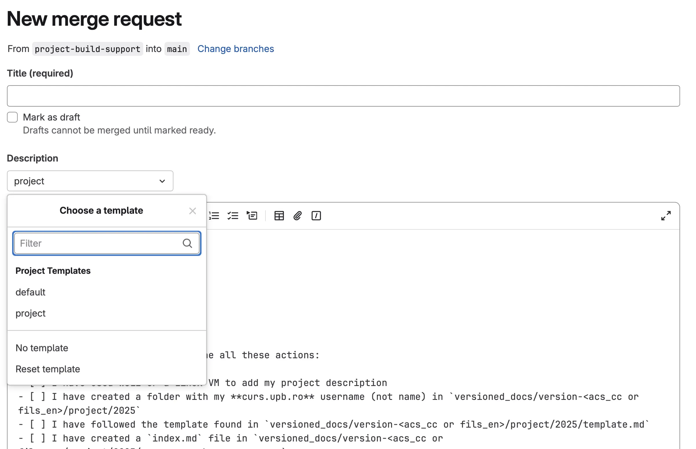

# Description

The goal of the project is to showcase the knowledge gained throughout the semester by creating functional hardware that runs software written in Rust.

## Deliverables
The deliverables will be stored in two places: 
- the *source code* will be stored on [Github](https://github.com/UPB-PMRust-Students) 
- the project documentation will be stored on [Gitlab](https://gitlab.cs.pub.ro/pmrust/pmrust.pages.upb.ro), by creating a fork of the course's website

The **documentation repository** should contain:
- the full documentation of the project, in the `index.md` file
  - a description of the functionality
  - the motivation for choosing the project
  - the architecture
    - a description of all components and how they interconnect
    - a diagram drawn in [diagrams.net](https://app.diagrams.net/) or similar
  - a weekly log of the project status
  - hardware design
    - a description of the hardware used
    - a schematic drawn in [KiCad EDA](https://www.kicad.org/) or similar
    - photos of the device
  - software design
    - detailed design
    - functional diagram
  - bill of materials (hardware and software)
- the photos and other files required by the index.md file

:::warning 

You need to work in a fork of this website's Gitlab repository and not in a blank one, in order to create a _merge request_, as described below.

:::

The **source code repository** should contain:
- a brief documentation - the repository's `README.md` file
  - short description of the functionality
  - requirements (hardware and software)
  - brief hardware and software design, including diagrams
- software source code

The repositories will be checked by the lab assistant at during lab reserved for the project. Uploading code on the last day of the software milestone is not allowed. **The assistant** will check that students have **submitted regular commits** to the repository.

Students will have to build and showcase the hardware with the running software at PM Fair. On the presentation day, **students will upload the source code to the hardware** and the demo will be done live in front of the committee.

## Website build pre-requisites

:::danger Windows support
If you are using Windows, you will either need to install WSL2, for which you will find a detailed tutorial [here](https://learn.microsoft.com/en-us/windows/wsl/install), or use a VM with Ubuntu, Debian or another Linux based OS.
:::

You will need to install `npm` and `node` and the simples way to do that can be found on [Node.js Official Website](https://nodejs.org/en/download/).

:::note WSL2
If you are using WSL2, you should follow the instructions for installing on Linux.
:::

## How to create a page for your project?

:::important Windows Users
These steps should be performed on inside your **VM**, or in **WSL2**, **not on your host machine**.
:::

1. Please login with your UPB login to [Gitlab](https://gitlab.cs.pub.ro)
2. You will have to add an SSH Key to your Gitlab account. This will allow you to push code without entering you username and password every time. For this, run the following command in the Windows/Linux/macOS's console: `ssh-keygen -t rsa -b 2048`. Press press ENTER until you exit the respective command prompts.
 - If your command prompt `Overwrite (y/n)?` press `n` and run the above command again, changing the destination of the key.
 - If the key was generated successfully, you will have the keys generated in the location indicated by the command `Enter file in which to save the key (/home/"NAME"/.ssh/id_rsa):`
 - Read the content of the file `id_rsa.pub` or the name you gave to the file and transfer it to Github.
 - Login to [Gitlab](https://gitlab.cs.pub.ro/) and go to: [SSH Keys](https://gitlab.cs.pub.ro/-/user_settings/ssh_keys).
 - Click on *Add new key* and insert into the *Key* textbox your key from `id_rsa.pub`.
 - Be very careful about the expiration date of the ssh key, change the expiration date otherwise it is set to 30 days.

3. [Download Git](https://git-scm.com) from the official website and access it in the command line using `git -v` to check if it was installed correctly. You might have to use *Git Bash*.
4. Navigate to the [website's Gitlab repository](https://gitlab.cs.pub.ro/pmrust/pmrust.pages.upb.ro) and create a public fork by clicking on the button in the top right corner.

5. Clone the newly created repository by running `git clone git@gitlab.cs.pub.ro:<gitlab_username>/pmrust.pages.upb.ro.git`, where `<gitlab_username>` is replaced by your gitlab username.

6. Now you have your own clone. You need to create a new branch. For this, follow the steps:
  - Run the command: `git fetch` followed by the `git pull` command
  - The branches have the following naming convention: `project/your_curs.upb.ro_username`. Example: `project/andrei_paul.zamfir`
  - To create a new branch:
    - `git checkout -b <branch_name>`
    - `git push --set-upstream origin project/your_curs.upb.ro_username`

7. To start creating your page for the project, go to `website/versioned_docs/version-fils_en/project/2025` and create a new directory with your curs.upb.ro username. Example: `andrei_paul.zamfir`.

8. In that directory you must create a file named `index.md` which will be your project page. This page must follow the project [template page](./2025/template.md) You can take a look at the [Markdown](https://www.markdownguide.org/cheat-sheet/) syntax. You can look at [last year's projects](https://gitlab.cs.pub.ro/pmrust/pmrust.pages.upb.ro/-/tree/main/website/versioned_docs/version-fils_en/project/2024).

9. To build and test the website, you can run the `./build_website.sh` in the project's root folder, then run `cd ./website/ && npm run serve`.

:::note Development process
After running the script, you could run `npm run start` instead of `serve`. This would ensure that the changes you are making in your Markdown file reflect in the running build (without needing to rebuild the project over and over again). But make sure to re-run the build script when you are done, because some subtle bugs may not be caught by this method.
:::

10. After finishing the project, make a _merge request_ to the [upstream repository](https://gitlab.cs.pub.ro/pmrust/pmrust.pages.upb.ro). Do not forget to change the Merge Request Description template to **project**.

:::info Merge Request contents
The merge requests should contain only the Markdown page, and additional images in `svg` or `webp` format that must not exceed **1024x768** pixels.
:::

## Hardware Rules

1. Projects have to use a microcontroller (MCU) that is capable of running Rust code. Examples of MCUs are *nRF52*, *RP2040*, *ESP32* (RISC-V version). 
2. Usage of a development board is encouraged, but not required, a custom PCB can be built. Example of development boards are:
  - [Raspberry Pi Pico 2](https://www.raspberrypi.com/documentation/microcontrollers/raspberry-pi-pico.html) (RP2350) or [Raspberry Pi Pico 2W](https://www.raspberrypi.com/documentation/microcontrollers/raspberry-pi-pico.html) for WiFi (The version of Pico is not important, but we encourage the use of version 2.)
  - [Adafruit Trinkey QT2040](https://www.adafruit.com/product/5056) (RP2040)
  - [Arduino Nano RP2040 Connect](https://store.arduino.cc/products/arduino-nano-rp2040-connect) (RP2040) - ⚠️ [^arduino_nano_rp2040_connect]
  - [micro:bit v2](https://microbit.org/) (nRF52833)
  - [nRF52 DK](https://www.nordicsemi.com/Products/Development-hardware/nrf52-dk) (nRF52810)
  - [STM32 NUCLEO-F401RE](https://ro.mouser.com/ProductDetail/STMicroelectronics/NUCLEO-F401RE?qs=sGAEpiMZZMuqBwn8WqcFUv%2FX0DKhApUpi46qP7WpjrffIid8Wo1rTg%3D%3D)
  - [ESP32-C3-DevKit-RUST-1](https://www.espressif.com/en/dev-board/esp32-c3-devkit-rust-1-en) (ESP32-C3) - ⚠️ [^esp32_riscv]
3. The hardware part may be designed either using a breadboard and jumper wires, a prototype board (solder breadboard) or a PCB. If you want to use prototyping boards, ask the lab coordinator for help with soldering during lab hours.

## Software Rules
It has to run software written in Rust. Students can use:
- [embassy-rs](https://embassy.dev/)
- [RTIC](https://rtic.rs/2/book/en/)
- [bare metal](https://docs.rs/cortex-m-rt/latest/cortex_m_rt) - the cortex-r-rt crate
- [Tock](https://www.tockos.org)
- any other software framework that is written in Rust

## Project Rules

1. Copying schematics or source code from the Internet is not allowed. Any attempt to copy the project will be accompanied by the corresponding repercussions.
2. The project is individual, any attempt at collaborative work will be sanctioned, students can also carry out projects that interact, but the work must be separate.
3. Any problem or blockage you have will be discussed with the lab assistant during project work hours.
4. Students are strongly encouraged to ask the lab assistant questions about the project.
5. The presentation of all the milestones is mandatory.
6. The project topic must be established in week 4 and approved by the lab coordinator by week 6. After week 6, the topic cannot be changed.
7. The laboratory supervisor may modify the topic or propose another topic if it is not complex enough for this project.
8. We encourage you not to use prebuilt kits, you may get less points for the hardware part.

## Requirements
1. *Complexity:* The project must reflect at least 40 hours of work and contain elements learned during the year.
2. *Documentation:* Complete documentation of the implementation for both hardware and software.
3. *Functionality:* The hardware device has to be fully functional.

The **IoT** stream has to use the networking (**WiFi**, **Bluetooth** or **Ethernet**).

## Example Projects

### Examples of projects from past years
1. [Projects from 2024](/docs/fils_en/category/projects-2024)
1. https://ocw.cs.pub.ro/courses/pm/prj2022
2. https://ocw.cs.pub.ro/courses/pm/prj2023

### Outstanding Projects
1. [POV - DAVIC picTronics](https://ocw.cs.pub.ro/courses/pm/prj2023/gpatru/376)
2. [Ryobo - Computer Vision & Object Following](https://ocw.cs.pub.ro/courses/pm/prj2023/gpatru/483)
3. [Plug & Play ChatGPT](https://ocw.cs.pub.ro/courses/pm/prj2023/ncaroi/plug)
4. [VENDING MACHINE](https://ocw.cs.pub.ro/courses/pm/prj2023/drtranca/vending.machine)

## Grading

| Part | Deadline | Points |
|--------|--------|--------|
| Documentation Milestone | Lab 9 | 0.5p |
| Hardware Milestone | Lab 11 | 0.5p |
| Software Milestone | Lab 12 | 0.5p |
| PM Fair | TBD | 1.5p |
| **Total** |  | **3p** |

## F.A.Q
**Q:** Can I use another programming language, not Rust?\
**A:** No, the main focus of the project is to learn to work with microcontrollers using Rust.

**Q:** Can I use a different framework than [embassy-rs](https://github.com/embassy-rs/embassy)?\
**A:** Yes, we suggest taking a look at [RTIC](https://rtic.rs/2/book/en/) or [Tock](https://github.com/tock/tock).

**Q:** What if the PCB arrives after the hardware milestone?\
**A:** You will only present the diagram for the hardware part and if there is a prototype using breadboard, but at the end of the project you must necessarily have the PCB printed and functional.

[^arduino_nano_rp2040_connect]: Some function of this board, like WiFi, might not be supported in Rust.
[^esp32_riscv]: ESP32 provides its own Rust SDK described in the [The Rust on ESP Book](https://docs.esp-rs.org/book/introduction.html).

